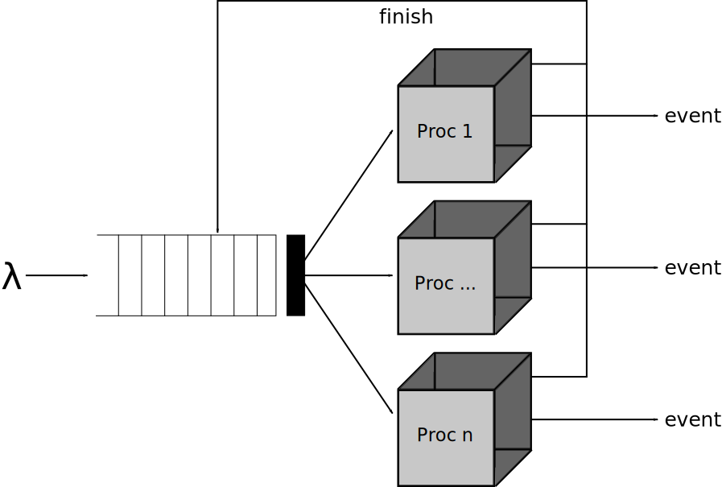
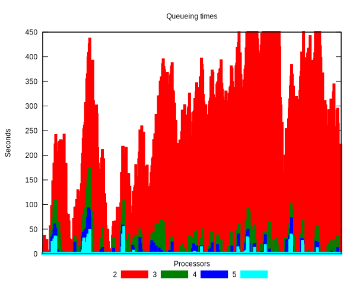
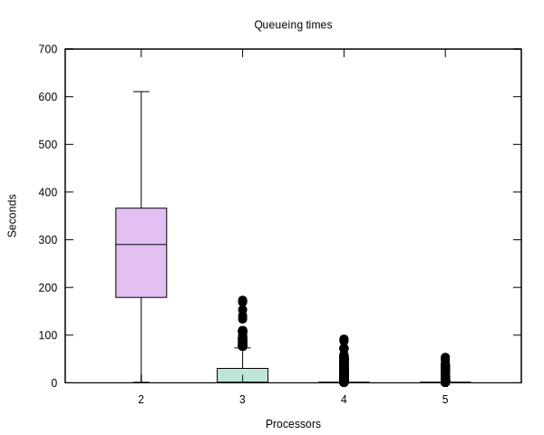

Application to Queueing Systems
===============================

To present a more realistic model and highlight the potential for performance analysis, we present a simple queueing system.
While a lot has been done in queueing theory, we present simulation as an alternative to the mathematical solutions.
Even though the mathematical solutions have their advantages, simulation offers more flexibility and doesn't get that complex.
It is, however, necessarily limited to sampling: simulations will only take samples and will therefore generally not find rare and exceptional cases.
Not taking them into account is fine in many situations, as it is now in our example model.

In this section, we present a simple queueing problem.
Variations on this model --- in either its behaviour, structure, or parameters --- are easy to do.

Problem Description
-------------------

In this example we model the behaviour of a simple queue that gets served by multiple processors.
Implementations of this queueing systems are widespread, such as for example at airport security.
Our model is parameterizable in several ways: we can define the random distribution used for event generation times and event size, the number of processors, performance of each individual processor, and the scheduling policy of the queue when selecting a processor.
Clearly, it is easier to implement this, and all its variants, in DEVS than it is to model mathematically.
For our performance analysis, we show the influence of the number of processors (e.g., metal detectors) on the average and maximal queueing time of jobs (e.g., travellers).

A model of this system is shown next.

Events (people) are generated by a generator using some distribution function.
They enter the queue, which decides the processor that they will be sent to.
If multiple processors are available, it picks the processor that has been idle for the longest; if no processors are available, the event is queued until a processor becomes available.
The queue works First-In-First-Out (FIFO) in case multiple events are queueing.
For a processor to signal that it is available, it needs to signal the queue.
The queue keeps track of available processors.
When an event arrives at a processor, it is processed for some time, depending on the size of the event and the performance characteristics of the processor.
After processing, the processor signals the queue and sends out the event that was being processed.

Description in DEVS
-------------------

While examples could be given purely in their formal description, they would not be executable and would introduce a significant amount of accidental complexity.
To specify this model, we first define the event exchanged between different examples: the Job.
A job is coded as a class ``Job``.
It has the attributes ``size`` (i.e., indicative of processing time) and ``creation time`` (i.e., time the event was created, for statistic gathering).
The ``Job`` class definition is shown next and can de downloaded: :download:`job.py <../examples/queueing/job.py>`.

.. literalinclude:: ../examples/queueing/job.py

We now focus on each atomic model seperately, starting at the event generator.

The *generator* is defined as an atomic model using the class ``Generator``.
Classes that represent an atomic model inherit from the ``AtomicDEVS`` class.
They should implement methods that implement each of the DEVS components.
Default implementations are provided for a passivated model, such that unused functions don't need to be defined.
In the constructor, input and output ports are defined, as well as model parameters and the initial state.
We see that the definition of the generator is very simple: we compute the time remaining until the next event (``remaining``), and decrement the number of events to send.
The generator also keeps track of the current simulation time, in order to set the creation time of events.
The time advance function returns the time remaining until the next internal transition.
Finally, the output function returns a new customer event with a randomly defined size.
The job has an attribute containing the time at which it was generated.
Recall, however, that the output function was invoked before the internal transition, so the current time has not yet been updated by the internal transition.
Therefore, the output function also has to do this addition, without storing the result in the state (as it cannot write to the state).
The ``Generator`` class definition is shown next and can de downloaded: :download:`generator.py <../examples/queueing/generator.py>`.

.. literalinclude:: ../examples/queueing/generator.py

Next up is the queue, which is the most interesting component of the simulation, as it is the part we wish to analyze.
The ``Queue`` implementation is similar in structure to the ``Generator``.
Of course, the \DEVS parts get a different specification, as shown in Listing~\ref{lst:queue}.
The queue takes a structural parameter, specifying the number of processors.
This is needed since the queue has an output port for each processor.
When an internal transition happens, the queue knows that it has just output an event to the first idle processor.
It thus marks the first idle processor as busy, and removes the event it was currently processing.
If there are events remaining in the queue, and a processor is available to process it, we process the first element from the queue and set the ``remaining\_time`` counter.
In the external transition, we check the port we received the event on.
Either it is a signal of the processor to indicate that it has finished, or else it is a new event to queue.
In the former case, we mark the processor that sent the event as idle, and potentially process a queued message.
For this to work, the processor should include its ID in the event, as otherwise the queue has no idea who sent this message.
In the latter case, we either process the event immediately if there are idle processors, or we store it in the queue.
The time advance merely has to return the ``remaining\_time`` counter that is managed in both transition functions.
Finally in the output function, the model outputs the first queued event to the first available processor.
Note that we can only read the events and processors, and cannot modify these lists: state modification is reserved for the transition functions.
An important consideration in this model is the ``remaining\_time`` counter, which indicates how much time remains before the event is processed.
We can't simply put the processing time of events in the time advance, as interrupts could happen during this time.
When an interrupt happens (e.g., another event arrives), the time advance is invoked again, and would return the total processing time, instead of the remaining time to process the event.
To solve this problem, we maintain a counter that explicitly gets decremented when an external interrupt happens.
The ``Queue`` class definition is shown next and can de downloaded: :download:`queue.py <../examples/queueing/queue.py>`.

.. literalinclude:: ../examples/queueing/queue.py

The next atomic model is the ``Processor`` class.
It merely receives an incoming event and starts processing it.
Processing time, computed upon receiving an event in the external transition, is dependent on the size of the task, but takes into account the processing speed and a minimum amount of processing that needs to be done.
After the task is processed, we trigger our output function and internal transition function.
We need to send out two events: one containing the job that was processed, and one to signal the queue that we have become available.
For this, two different ports are used.
Note that the definition of the processor would not be this simple in case there was no queue before it.
We can now make the assumption that when we get an event, we are already idle and therefore don't need to queue new incoming events first.
The ``Processor`` class definition is shown next and can de downloaded: :download:`processor.py <../examples/queueing/processor.py>`.

.. literalinclude:: ../examples/queueing/processor.py

The processor finally sends the task to the ``Collector`` class.
The collector is an artificial component that is not present in the system being modeled; it is only used for statistics gathering.
For each job, it stores the time in the queue.
The ``Collector`` class definition is shown next and can de downloaded: :download:`collector.py <../examples/queueing/collector.py>`.

.. literalinclude:: ../examples/queueing/collector.py

With all atomic examples defined, we only have to couple them together in a coupled model: the ``System``.
In this system, we instantiate a generator, queue, and collector, as well as a variable number of processors.
The number of processors is variable, but is still static during simulation.
The couplings also depend on the number of processors, as each processor is connected to the queue and the collector.
The ``System`` class definition is shown next and can de downloaded: :download:`system.py <../examples/queueing/system.py>`.

.. literalinclude:: ../examples/queueing/system.py

Now that our DEVS model is completely specified, we can start running simulations on it.
Simulation requires an *experiment* file though, which initializes the model with parameters and defines the simulation configuration.
The experiment writes out the raw queueing times to a Comma Seperated Value (CSV) file.
An experiment file often contains some configuration of the simulation tool, which differs for each tool.
The experiment file is shown next and can de downloaded: :download:`experiment.py <../examples/queueing/experiment.py>`.

.. literalinclude:: ../examples/queueing/experiment.py

Performance Analysis
--------------------

After the definition of our DEVS model and experiment, we of course still need to run the simulation.
Simply by executing the experiment file, the CSV file is generated, and can be analyzed in a spreadsheet tool or plotting library.
Depending on the data stored during simulation, analysis can show the average queueing times, maximal queueing times, number of events, processor utilization, and so on.

Corresponding to our initial goal, we perform the simulation in order to find out the influence of opening multiple processors on the average and maximum queueing time.
First, we show the evolution of the waiting time for subsequent clients.

The same results can be visualized with boxplots.

These results indicate that while two processors are able to handle the load, maximum waiting time is rather high: a median of 200 seconds and a maximum of around 470 seconds.
When a single additional processor is added, average waiting time decreases significantly, and the maximum waiting time also becomes tolerable: the mean job is served immediately, with 75% of jobs being handled within 25 seconds.
Further adding processors still has a positive effect on queueing times, but the effect might not warrant the increased cost in opening processors: apart from some exceptions, all customers are processed immediately starting from four processors.
Ideally, a cost function would be defined to quantize the value (or dissatisfaction) of waiting jobs, and compare this to the cost of adding additional processors.
We can then optimize that cost function to find out the ideal balance between paying more for additional processors and losing money due to long job processing times.
Of course, this ideal balance depends on several factors, including our model configuration and the cost function used.
